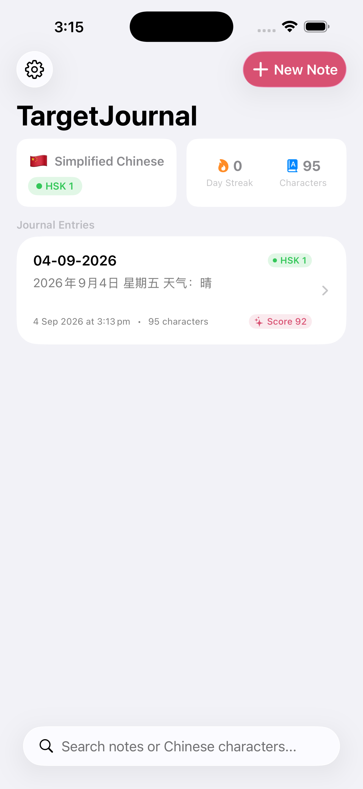
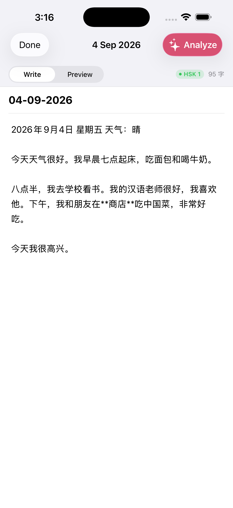
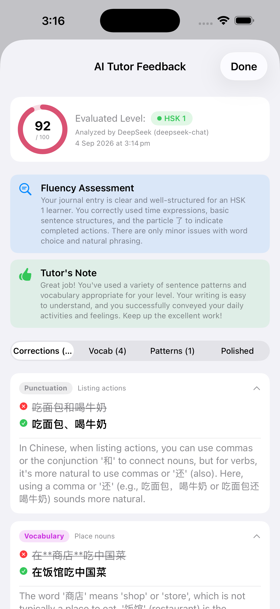

# TargetJournal 🌍 ✍️

A modern, native iOS app engineered in **SwiftUI**, **SwiftData**, and **Swift 6** designed specifically for journaling in your target language with AI-powered language evaluation and personalized tutoring across **10 languages** and **5 LLM providers**.

---

## ✨ Features

- 🌍 **Multi-Language & Level Calibration**:
  - 🇨🇳 **Simplified Chinese** (HSK 1–9)
  - 🇹🇼 **Traditional Chinese** (TOCFL / HSK)
  - 🇯🇵 **Japanese** (JLPT N5–N1)
  - 🇰🇷 **Korean** (TOPIK 1–6)
  - 🇪🇸 **Spanish** (CEFR A1–C2)
  - 🇫🇷 **French** (CEFR A1–C2)
  - 🇩🇪 **German** (CEFR A1–C2)
  - 🇮🇹 **Italian** (CEFR A1–C2)
  - 🇧🇷 **Portuguese** (CEFR A1–C2)
  - 🇷🇺 **Russian** (CEFR / TORFL A1–C2)
- 🤖 **Multi-Provider AI Language Critique**:
  - **DeepSeek** (`deepseek-chat`, `deepseek-reasoner`)
  - **OpenAI** (`gpt-4o`, `gpt-4o-mini`, `o3-mini`, `gpt-4.5-preview`)
  - **Anthropic Claude** (`claude-3-7-sonnet-20250219`, `claude-3-5-sonnet`, `claude-3-5-haiku`)
  - **Google Gemini** (`gemini-2.5-flash`, `gemini-2.5-pro`, `gemini-2.0-flash`)
  - **Custom / Local Ollama & LM Studio** (`qwen2.5`, `llama3.3`, `mistral-small`, etc.)
  - Fluency & grammar scoring calibrated to the user's proficiency level.
  - Detailed grammar corrections with categorized rule badges and explanations.
  - Level-up vocabulary recommendations with pronunciation, translations, and context notes.
  - Side-by-side original vs. polished native version comparison with one-tap clipboard copy.
- 📝 **Hybrid Markdown & WYSIWYG Editor**:
  - Live preview with CJK & international line-height typography.
  - Dedicated punctuation accessory bar for CJK and standard formatting.
  - Standard Markdown quick-insert bar (headings, bold, lists, quotes, checkboxes).
- 🔒 **Local & Secure**:
  - All API keys stored securely in isolated **Apple Keychain** accounts.
  - All journal entries persisted on-device using **SwiftData**.

---

## 📱 Screenshots

<div align="center">

| Home Timeline | Markdown & WYSIWYG Editor | AI Tutor Analysis |
| :---: | :---: | :---: |
|  |  |  |

</div>

---

## 🚀 Getting Started

### 1. Open the Project in Xcode
Open `TargetJournal.xcodeproj` in Xcode (or regenerate using `xcodegen generate`):
```bash
open TargetJournal.xcodeproj
```

### 2. Configure DeepSeek API Key
1. Run the app in the Simulator or on your device.
2. Complete the initial onboarding flow (select Simplified Chinese, choose your HSK level, and enter your DeepSeek API key starting with `sk-...`).
3. You can also modify or test your API key anytime in **Settings (`⚙️`)**.

### 3. Run Tests
Run the test suite using Swift PM or Xcode:
```bash
swift test
```

---

## 🛠️ Requirements
- **iOS 18+** / **iOS 26+** (designed for modern iPhone displays including iPhone 17 Pro Max)
- **Xcode 16+ / 26+**
- **Swift 6**
